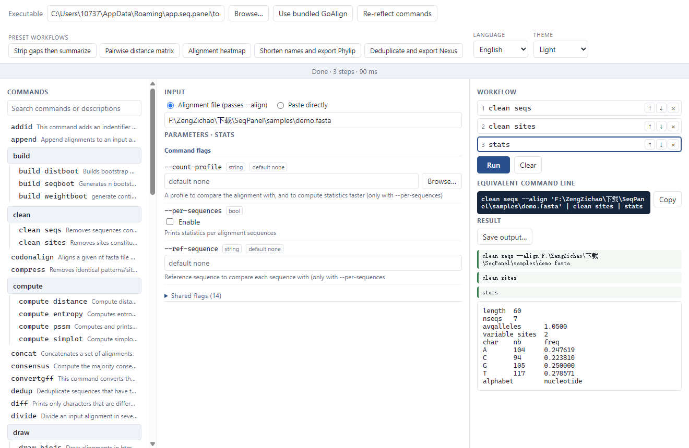

# SeqPanel documentation

SeqPanel is a Windows graphical panel for cobra-based phylogenetics command-line tools. It ships
with **GoAlign v0.4.1** embedded, reflects the command tree of whichever binary you point it at,
and runs your chains as real shell pipelines.

[Project home](../../README.md) · [简体中文文档](../zh/README.md)

## Pages

| Page | What it answers |
|---|---|
| [Getting started](getting-started.md) | What to install, what first launch looks like, your first command |
| [Interface tour](interface.md) | Every control, column, status message and form section |
| [Workflows and pipelines](workflows.md) | Chaining commands, the presets, recipes, when a chain must stop |
| [Language and theme](language-and-theme.md) | What is bilingual, what is deliberately not, where choices are stored |
| [Command coverage](command-reference.md) | How reflection works, all 76 commands by group, writing a tool pack |
| [Building from source](building-from-source.md) | Toolchain, dev loop, the single-exe build, tests, rebuilding the embedded CLI |
| [Troubleshooting](troubleshooting.md) | Reading GoAlign's errors, empty results, format complaints, numbers that look wrong |

## The five things worth knowing before you start

1. **Nothing is hidden.** Every workflow has an equivalent command line on screen, and copying it
   into a terminal reproduces the result exactly.
2. **Input is `--align`, not `--input`.** GoAlign calls its input flag `--align` and its output
   flag `--output`; the panel wires whichever name the reflected binary actually uses.
3. **Some commands end a chain.** `stats`, `compute distance` and `draw png` consume the
   alignment and print something else, so they must be last.
4. **Five commands read bare arguments** that `--help` never mentions — `append`, `concat`,
   `revcomp`, `subset`, `subsites`. The panel shows an input row for those and only those.
5. **The only external dependency is the WebView2 Runtime**, pre-installed on Windows 11.

## Getting help

Usage questions and defects: open an issue against this repository. GoAlign's own behaviour —
which model a command supports, what a flag really does — is upstream's domain, and
`goalign <command> --help` is authoritative; the panel is generated from exactly that text.
