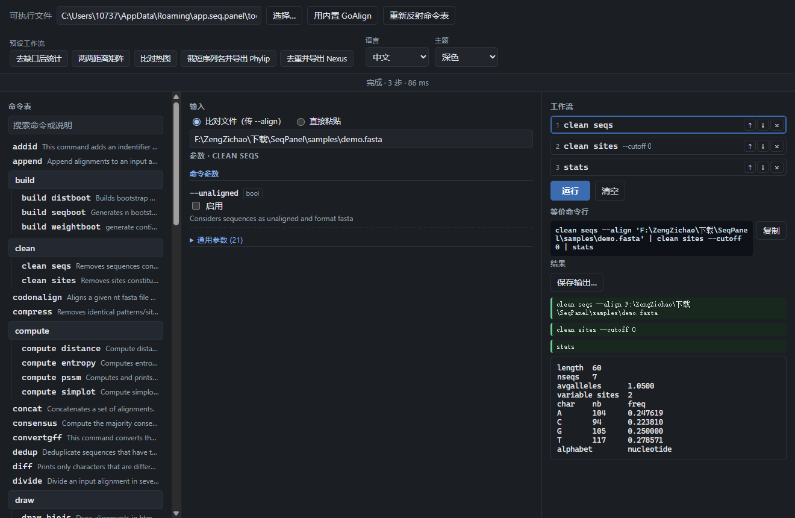

# 界面导览



窗口由顶栏、状态栏和三列组成：命令表、输入与参数、工作流与结果。

## 顶栏

| 控件 | 作用 |
|---|---|
| **可执行文件**框 | 面板当前驱动的二进制。可以直接编辑，回车即重新反射。 |
| **选择…** | 同一个东西的文件对话框（`exe`、`bin` 或任意文件）。 |
| **用内置 GoAlign** | 把面板指回编译进 `seqpanel.exe` 的那份 GoAlign，它解在 `%APPDATA%\app.seq.panel\tools\`。 |
| **重新反射命令表** | 忽略缓存重走一遍 `--help`。换了二进制之后需要点它，因为缓存键是文件名 + 修改时间。 |
| **预设工作流**按钮 | 用人工整理的多步链条整体替换当前工作流。GoAlign 带 5 个。 |
| **语言** | 中文 / English，即时生效并记住。 |
| **主题** | 跟随系统 / 浅色 / 深色，原生标题栏一起变。 |

## 状态栏

一行三种状态：正常、琥珀色警告、红色失败。它先报告被反射的工具、版本、命令数量和是否命中缓存，
再报告最近一次操作的结果：

```
GoAlign  ·  v0.4.1  ·  76 个可执行命令 / 42 个顶层命令族  ·  命令表来自缓存
完成 · 3 步 · 86 ms
1/2 步失败 · fasta file should start with a >
```

后端错误以 `E#<key>|<detail>` 过 IPC，再按当前界面语言渲染成上面这样的人话。

## 第一列：命令表

反射出来的命令树，已排序，每条命令旁边是上游说明的首行。搜索框按命令名*或*说明过滤，并保留命中
项的父级节点。

两种形态要分清：

- 纯命令组（`build`、`clean`、`compute` 等）只是容器，点它没有反应。
- 带 `可执行` 标记的组标题是**既能自己运行又有子命令**的命令。GoAlign 里有两个：`replace` 和
  `stats`。点标题加入的是它本身，下面列出的子命令是另外的命令。

点任意命令都会把它追加到工作流并打开它的表单。

## 第二列：输入，然后参数

**输入**提供互斥的两种模式：文件路径（交给 CLI 的输入开关），或粘贴文本（写进第一个子进程的
stdin）。路径会在两次运行之间保留。

**参数**按命令生成，分两块：

- **命令参数**——该命令自己 `Flags:` 段声明的开关。
- **通用参数 (n)**——折叠起来的继承开关。GoAlign 这里是每条命令都带的 14 个根级开关
  （`--align`、`--phylip`、`--nexus`、`--clustal`、`--stockholm`、`--auto-detect`、`--alphabet`、
  `--threads`、`--seed`、`--ignore-identical`、`--input-strict`、`--output-strict`、`--one-line`、
  `--no-block`），再加上所属命令组自己追加的那些，所以 `stats` 会显示 21 个。

每行给出长名与短名、值类型、上游默认值和上游说明。控件按反射出来的类型生成：`bool` 是复选框，
`int` / `float` 是数字框，`string` 是文本框，`stringSlice` 用逗号分隔多项，说明里枚举了取值时给
下拉。名字或语义角色属于路径的开关会额外有 **浏览…** 按钮（输入类是打开、输出类是另存）。

如果选中的命令正好是那 5 个读裸参数的命令之一——`append`、`concat`、`revcomp`、`subset`、
`subsites`——会多出一行：标签来自人工整理，输入框里的词按空格拆成多个参数。其他命令不会出现这一
行，因为给它们多传参数没有任何作用。

## 第三列：工作流、等价命令行、结果

**工作流**按顺序列出链条里的步骤。点某步可编辑它，上下箭头调顺序，`×` 删除。步骤之间是真实的操
作系统管道：第 *n* 步的 stdout 直接接到第 *n+1* 步的 stdin，中间结果从不落到磁盘。

**等价命令行**由构造进程参数的同一段代码渲染，因此不可能与实际执行的东西不一致。只是复述 CLI 默认
值的开关会被省略。**复制**把它放进剪贴板。

**结果**为每一步给一行记录。失败的步骤会显示从 GoAlign 的
`[Error] in cmd/<文件>.go (line N), message: <原因>` 里抽出来的那句话，原始 stderr（含整段
usage）收在可展开的折叠块里。步骤行下方：

- 文本用等宽块显示（比对、统计表、距离矩阵）；
- `draw png` 的 PNG 直接内嵌显示；
- SVG 输出同样内嵌显示，若生成端漏了 `viewBox`，面板会补一个以便缩放。

**保存输出…** 在一次成功运行后启用，把最后一步的产物写成文件。
